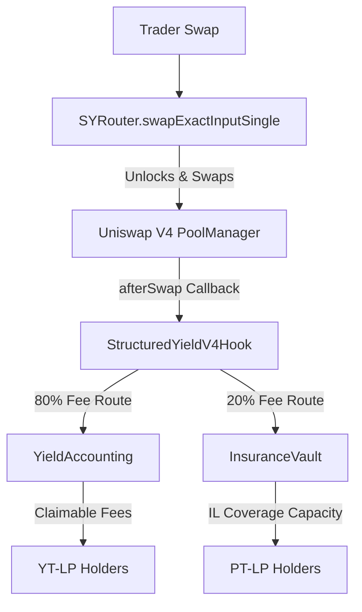

# StructuredYield - Fixed-Income & Yield Tranching Hook

StructuredYield makes Uniswap v4 LPing predictable by splitting liquidity into principal-protected claims (PT-LP) and yield-bearing fee streams (YT-LP). 

StructuredYield turns impermanent loss into a priced risk market inside a Uniswap v4 pool. Principal LPs get a fixed claim on their original deposit at maturity. Yield LPs hold the right to the pool's swap fees. A portion of all swap fees is routed to an insurance reserve to cover the principal LP's impermanent loss.

UHI9 Theme: Impermanent Loss and Yield Systems

## Problem
Passive LPs underwrite impermanent loss and loss-versus-rebalancing without a clear way to limit their downside or separate their risk profile. This keeps conservative capital out of volatile Uniswap pools and forces all LPs to accept the same risk-return profile.

## Solution
StructuredYield introduces a fixed-income tranching layer around a Uniswap v4 pool:

1. **PT-LP (Principal Token):** Represents the LP’s principal claim. Protected from IL by the insurance reserve.
2. **YT-LP (Yield Token):** Represents the fee stream generated by the LP position.
3. **Insurance Reserve:** A junior first-loss reserve that collects a portion of swap fees (20%) to build a USDC backing against impermanent loss.
4. **Traders:** Swap normally. A portion of their swap fee is routed to the YT-LP holders (80%) and the insurance reserve (20%).
5. **Maturity:** At maturity, the hook compares the LP's exit value against their initial deposit. Covered loss is paid from the insurance reserve.

The MVP keeps the mechanism self-contained. It relies on standard V4 swap fees and uses the hook's `afterSwap` to route accounting units, avoiding complex external lending or options markets.

## Why This Is Novel
StructuredYield is not just a dynamic fee hook or an IL calculator. The core idea is tranche-based LP risk separation attached to real Uniswap v4 pool lifecycle events:

- Vanilla LPs sit in one blended risk class and absorb IL silently.
- StructuredYield LPs split their position into PT (safe principal) and YT (volatile yield).
- Traders fund the insurance reserve simply by swapping, as the hook routes a percentage of standard fees to the vault.
- The hook records LP protection during liquidity lifecycle callbacks and routes fees during swap callbacks.

## Why Uniswap v4 Hooks
Uniswap v4 hooks can run around pool lifecycle events. StructuredYield uses this to:

- Observe liquidity additions to mint PT/YT tokens.
- Intercept swap fees via `afterSwap` to route them to the yield accounting system and the insurance reserve.
- Intercept liquidity removals via `beforeRemoveLiquidity` to calculate and pay out IL coverage before the LP withdraws.
- Keep pool-specific PT/YT accounting without forking Uniswap.

## Architecture



## File Structure
The project is split into a Foundry smart contract workspace and a Next.js frontend:

```text
📦 StructuredYield-Hook
 ┣ 📂 contracts
 ┃ ┣ 📂 script          # Foundry deployment & funding scripts
 ┃ ┣ 📂 src
 ┃ ┃ ┣ 📂 accounting    # Yield cumulative fee logic
 ┃ ┃ ┣ 📂 math          # IL math and premium calculations
 ┃ ┃ ┣ 📂 periphery     # SYRouter and SYLens
 ┃ ┃ ┣ 📂 tokens        # PTToken and YTToken ERC20s
 ┃ ┃ ┣ 📂 vault         # InsuranceVault for USDC custody
 ┃ ┃ ┣ 📜 StructuredYieldHook.sol
 ┃ ┃ ┗ 📜 StructuredYieldV4Hook.sol
 ┃ ┗ 📂 test            # Foundry unit and integration tests
 ┗ 📂 frontend
   ┣ 📂 app
   ┃ ┣ 📂 dashboard     # LP Portfolio overview
   ┃ ┣ 📂 markets       # Available pools
   ┃ ┗ 📂 positions     # Position details & redemption
   ┣ 📂 components      # UI React components
   ┣ 📂 hooks           # Wagmi contract read/write hooks
   ┗ 📂 lib             # ABIs, math utils, addresses
```

## MVP Flow
1. Alice adds liquidity through the `SYRouter`. She is minted PT-LP and YT-LP tokens.
2. Bob (or the protocol) deposits real USDC into the `InsuranceVault` as reserve capital via `fundWithTokens`.
3. Traders swap through the v4 pool.
4. The hook's `afterSwap` routes 80% of the fee to YT holders and 20% to the insurance reserve.
5. Alice (holding YT-LP) can claim her accrued fees at any time.
6. At maturity, Alice removes her liquidity. The hook calculates her IL and pays it out from the `InsuranceVault`'s real USDC backing.

## Unichain Sepolia
Primary demo chain: Unichain Sepolia

- Chain ID: `1301`
- RPC: `https://sepolia.unichain.org`
- PoolManager: `0x00B036B58a818B1BC34d502D3fE730Db729e62AC`
- StateView: `0xc199F1072a74D4e905ABa1A84d9a45E2546B6222`

**Current Real-USDC v4 Deployment**
- USDC: `0x31d0220469e10c4E71834a79b1f276d740d3768F`
- WETH: `0x4200000000000000000000000000000000000006`
- StructuredYieldV4Hook: `0x7d68F662E056706476A04AD9CFca3740CaaeDb40`
- SYRouter: `0x6bd6903B652a2E37Fc189e7b3a1DEa2d6Bb77D63`
- SYLens: `0x6866ba266A127c13a2A6DD5877f7F229a75886c9`
- InsuranceVault: `0xe948E1EbEa6bff1cA9ED2b4552D2AA3463bc1f5D`
- Pool ID: `0x92b0899e642ee283b7673bfb931c1e44bb7c2a00c18cc1862d11d743dd8849e4`

The pool has been initialized on Unichain Sepolia and a real swap has been processed to prove fee routing.

## Security Model
- Hook callbacks are gated where necessary.
- `SYRouter` acts as a safe periphery for the complex V4 `unlock` flows.
- `InsuranceVault` uses `ReentrancyGuard` and `SafeERC20` for real USDC custody.
- YT token transfers are disabled in V1 to ensure fee accounting remains deterministically tied to the original depositor until a snapshot ownership model is built in V2.
- Pool initialization is restricted to the owner to prevent malicious 1-second maturity pools.
- Frontend swaps use a 2% slippage limit against the live testnet `sqrtPrice` to prevent sandwich attacks.

## Local Setup
This repository uses Foundry for contracts and Next.js for the frontend.

**Contracts:**
```bash
cd contracts
forge install
forge build
forge test -vvv
```

**Frontend:**
```bash
cd frontend
npm install
npm run dev
```
Open `http://localhost:3000`. The frontend is fully integrated with Wagmi and RainbowKit for Unichain Sepolia.

## Deployment
Deploy the full v4 integration to Unichain Sepolia:

```bash
cd contracts
source .env
forge script script/Deploy.s.sol --rpc-url unichain_sepolia --broadcast --verify
```

To fund the insurance vault with real USDC for IL coverage testing:
```bash
forge script script/FundVault.s.sol --rpc-url unichain_sepolia --broadcast
```

