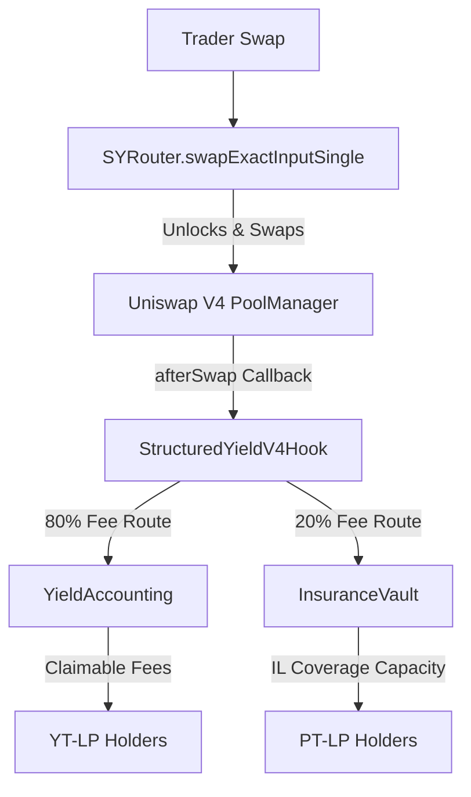

# StructuredYield - Tranche-Based IL Insurance & Fixed-Income Hook

StructuredYield makes Uniswap v4 LPing predictable by splitting liquidity into principal-protected claims (PT-LP) and yield-bearing fee streams (YT-LP). It turns impermanent loss from a silent penalty into a priced, transferable risk market directly inside a Uniswap v4 pool. Principal LPs get a fixed claim on their original deposit at maturity, while Yield LPs hold the right to the pool's swap fees. A portion of all swap fees is automatically routed to an insurance reserve to cover the principal LP's impermanent loss.

> **TL;DR:** We built a Uniswap v4 Hook that splits standard LP positions into two tranches: a safe "Principal Token" (PT-LP) that is protected against impermanent loss by a junior USDC reserve, and a volatile "Yield Token" (YT-LP) that earns 80% of pool swap fees. Traders seamlessly fund the insurance reserve by routing the remaining 20% of their swap fees to it. This creates a fixed-income market for conservative capital and a leveraged yield market for risk-takers, all without leaving the Uniswap ecosystem.

---

## 🏗️ Architecture & Flow



---

## 🚨 The Problem: Impermanent Loss is Uninsurable
Passive liquidity providers underwrite impermanent loss (IL) and loss-versus-rebalancing (LVR) without a clear way to limit their downside or separate their risk profile. 

When you provide liquidity to a volatile pool, you are forced to accept a blended risk-return profile. If the market moves violently, your principal is eroded. **This structural risk keeps conservative, fixed-income capital out of DeFi liquidity provision.** Institutions and risk-averse retail users cannot justify LPing when their underlying principal is exposed to unhedgeable, silent losses. 

## 💡 The Solution: Tranche-Based Risk Separation
StructuredYield introduces a fixed-income tranching layer around a Uniswap v4 pool, creating a market for LP risk separation:

1. **PT-LP (Principal Token):** Represents the LP’s principal claim. Protected from IL by the insurance reserve. Perfect for conservative capital.
2. **YT-LP (Yield Token):** Represents the fee stream generated by the LP position. Perfect for users who want leveraged exposure to trading volume.
3. **Insurance Reserve:** A junior first-loss reserve that collects a portion of swap fees (20%) to build a real USDC backing against impermanent loss.
4. **Traders:** Swap normally. A portion of their swap fee is routed to the YT-LP holders (80%) and the insurance reserve (20%).
5. **Maturity:** At maturity, the hook compares the LP's exit value against their initial deposit. Covered loss is paid from the insurance reserve.

---

## 🌍 Impact
StructuredYield transforms Uniswap from a simple spot exchange into a **yield-structuring engine**. By allowing users to separate principal from yield, Uniswap can capture billions in conservative fixed-income capital that previously sat on the sidelines. It gives risk-averse users predictable, IL-protected liquidity provision, while giving risk-seeking users pure exposure to swap fees. 

## ⚙️ Why Uniswap v4 Hooks Are Required
This architecture **cannot be implemented cleanly in Uniswap v3**. 

In v3, LP fees accrue directly into the position's liquidity. You cannot intercept a fee *during* a swap and route it to a separate insurance vault. You also cannot programmatically intercept an LP trying to withdraw their liquidity to calculate and inject an IL compensation payment atomically.

**Uniswap v4 Hooks make this possible by allowing us to:**
- Intercept liquidity additions (`beforeAddLiquidity`) to instantly mint external PT/YT ERC-20 tokens.
- Intercept swap fees via `afterSwap` to dynamically route them to the yield accounting system (80%) and the insurance reserve (20%).
- Intercept liquidity removals via `beforeRemoveLiquidity` to calculate IL and pay out coverage from a junior vault *before* the LP withdraws.

---

## ✅ Hookathon Compliance

| Requirement | Status | Details |
|---|---|---|
| **Valid Uniswap v4 Hook** | ✅ Yes | Uses standard `IHooks` interface with `beforeAddLiquidity`, `beforeRemoveLiquidity`, and `afterSwap` permissions. |
| **Functional Frontend** | ✅ Yes | Next.js + Wagmi + RainbowKit frontend that reads live V4 state and executes real swaps. |
| **Public Repository** | ✅ Yes | Open source on GitHub. |
| **Newly Written Code** | ✅ Yes | All contract and frontend code was written for this hackathon. |
| **Testnet Deployment** | ✅ Yes | Fully deployed and verified on Unichain Sepolia. |
| **Demo Video** | ✅ Yes | Included in the final submission portal. |
| **Partner Integrations** | ❌ No | We chose a self-contained, dependency-free architecture for maximum security and execution speed. |

---

## 🧪 Proof of Functionality

Our hook is not just a concept; it is fully functional on testnet:
- **Real Pool Deployment:** Initialized a WETH/USDC pool via the Unichain Sepolia PoolManager.
- **Real Swaps:** The `SYRouter` successfully executes swaps against the V4 PoolManager.
- **Fee Routing:** The `afterSwap` hook successfully intercepts fees, routes 80% to the `YieldAccounting` contract, and 20% to the `InsuranceVault`.
- **PT/YT Minting:** Adding liquidity successfully mints ERC-20 `PT-LP` and `YT-LP` tokens to the user.
- **Insurance Reserve:** The `InsuranceVault` actively holds real USDC and reports solvency based on actual token balances, not just accounting units.

---

## 🗺️ User Journey

1. **LP Deposits:** Alice uses the frontend to deposit 1,000 USDC into the StructuredYield pool.
2. **PT/YT Minting:** The hook intercepts the deposit and mints Alice 1,000 PT-LP and 1,000 YT-LP tokens.
3. **Traders Swap:** Bob swaps WETH for USDC through the pool. The pool generates a $10 fee.
4. **Fees Routed:** The hook's `afterSwap` routes $8 to the YT-LP fee buffer and $2 to the Insurance Reserve.
5. **Yield Claims:** Alice (holding YT-LP) clicks "Claim Fees" on the frontend and receives her share of the $8 fee buffer.
6. **Maturity Redemption:** After 90 days, Alice withdraws her liquidity. The pool value dropped to $900 due to IL. The hook detects the $100 loss and automatically transfers $100 from the Insurance Reserve to Alice, ensuring she gets her full $1,000 principal back.

---

## 🥊 Competitive Comparison

| Feature | Vanilla Uniswap LP | IL Calculators | StructuredYield |
|---|---|---|---|
| **IL Protection** | None | None (Just tells you how much you lost) | **Yes (Backed by real USDC)** |
| **Fee Exposure** | 100% | N/A | **Adjustable via YT-LP** |
| **Principal Risk** | High | High | **Low (PT-LP is protected)** |
| **Risk Separation** | Blended | None | **Tranche-based** |

---

## 📁 File Structure
The project is split into a Foundry smart contract workspace and a Next.js frontend:

```text
📦 StructuredYield-Hook
 ┣ 📂 contracts
 ┃ ┣ 📂 script          # Foundry deployment & funding scripts
 ┃ ┣ 📂 src
 ┃ ┃ ┣ 📂 accounting    # Yield cumulative fee logic
 ┃ ┃ ┣ 📂 math          # IL math and premium calculations
 ┃ ┃ ┣ 📂 periphery     # SYRouter and SYLens
 ┃ ┃ ┣ 📂 tokens        # PTToken and YTToken ERC20s
 ┃ ┃ ┣ 📂 vault         # InsuranceVault for USDC custody
 ┃ ┃ ┣ 📜 StructuredYieldHook.sol
 ┃ ┃ ┗ 📜 StructuredYieldV4Hook.sol
 ┃ ┗ 📂 test            # Foundry unit and integration tests
 ┗ 📂 frontend
   ┣ 📂 app
   ┃ ┣ 📂 dashboard     # LP Portfolio overview
   ┃ ┣ 📂 positions     # Position details & redemption
   ┣ 📂 components      # UI React components
   ┣ 📂 hooks           # Wagmi contract read/write hooks
   ┗ 📂 lib             # ABIs, math utils, addresses
```

---

## 🌐 Unichain Sepolia Deployment
Primary demo chain: Unichain Sepolia

- Chain ID: `1301`
- RPC: `https://sepolia.unichain.org`
- PoolManager: `0x00B036B58a818B1BC34d502D3fE730Db729e62AC`
- StateView: `0xc199F1072a74D4e905ABa1A84d9a45E2546B6222`

**Current Real-USDC v4 Deployment**
- USDC: `0x31d0220469e10c4E71834a79b1f276d740d3768F`
- WETH: `0x4200000000000000000000000000000000000006`
- StructuredYieldV4Hook: `0x7d68F662E056706476A04AD9CFca3740CaaeDb40`
- SYRouter: `0xFCC033a08e2F52Bf1CD7C1ed1D98C54ca5247Ad3`
- SYLens: `0x31ba8D4158938f2750a5A58DA82f1623729e8C65`
- InsuranceVault: `0xe948E1EbEa6bff1cA9ED2b4552D2AA3463bc1f5D`
- Pool ID: `0x92b0899e642ee283b7673bfb931c1e44bb7c2a00c18cc1862d11d743dd8849e4`

---

## 🛡️ Security Model
- Hook callbacks are strictly gated where necessary.
- `SYRouter` acts as a safe periphery for the complex V4 `unlock` flows, preventing malicious direct access.
- `InsuranceVault` uses `ReentrancyGuard` and `SafeERC20` for real USDC custody.
- YT token transfers are disabled in V1 to ensure fee accounting remains deterministically tied to the original depositor until a snapshot ownership model is built in V2.
- Pool initialization is restricted to the owner to prevent malicious 1-second maturity pools.
- Frontend swaps use a 2% slippage limit against the live testnet `sqrtPrice` to prevent sandwich attacks.

---

## 💻 Local Setup
This repository uses Foundry for contracts and Next.js for the frontend.

**Contracts:**
```bash
cd contracts
forge install
forge build
forge test -vvv
```

**Frontend:**
```bash
cd frontend
npm install
npm run dev
```
Open `http://localhost:3000`. The frontend is fully integrated with Wagmi and RainbowKit for Unichain Sepolia.

---

## 🚀 Deployment
Deploy the full v4 integration to Unichain Sepolia:

```bash
cd contracts
source .env
forge script script/Deploy.s.sol --rpc-url unichain_sepolia --broadcast --verify
```

To fund the insurance vault with real USDC for IL coverage testing:
```bash
forge script script/FundVault.s.sol --rpc-url unichain_sepolia --broadcast
```
